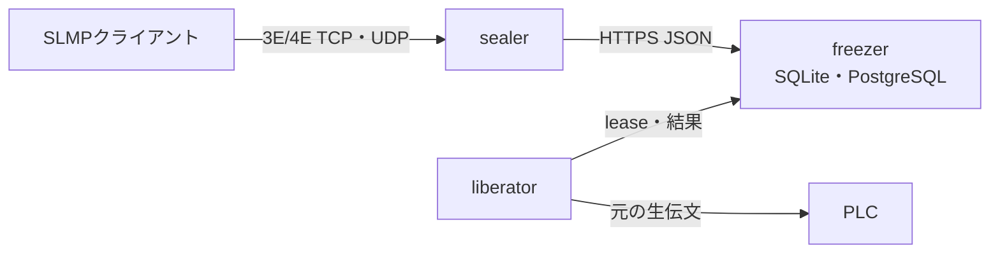

# TapirSLMP

[English](README.md)

TapirSLMPは、MELSEC SLMPのバイナリ3E/4E要求を、永続化されたHTTPジョブ
キュー経由で中継するOSSです。クライアントはローカルの**sealer**をPLCの
ように扱い、PLC側ネットワークに置いた**liberator**が**freezer**から古い
要求を取得して実行し、応答伝文を同じジョブへ返します。

> 本番利用前に、対象PLC・ネットワーク
> ポリシー・障害要件に対して十分に検証してください。SLMPの書込みや
> リモート操作は設備の状態変更・停止につながります。



## 設計上の特徴

- PLC側ネットワークからは、freezerへの外向きHTTPS接続だけで運用できます。
- freezerのデータは永続化します。SQLiteの`:memory:`やサーバーレス関数の
  一時フォルダは意図的に対象外です。
- 永続ボリューム上の単一freezerにはSQLite、複数インスタンスや高い並行性が
  必要な場合はPostgreSQLを選べます。
- routeごとにFIFOで処理し、同じrouteの実行中leaseは最大1件です。
- 終端jobは既定で168時間保持し、`Freezer__TerminalRetentionHours`で変更できます。
- PLCへ届いた可能性がある状態変更要求で応答を失った場合は
  `OutcomeUnknown`とし、自動再実行しません。
- 既知の読出しコマンド以外は、明示的に許可しない限りfreezerが拒否します。

## 対応範囲

| 項目 | 対応 |
| --- | --- |
| フレーム | バイナリ3E、バイナリ4E |
| クライアント側listener | TCP、UDP、または両方 |
| PLC側transport | routeごとに許可したTCP・UDP |
| DB | SQLite、PostgreSQL |
| 順序 | routeごとに古い要求から、同時実行は1件 |
| ASCII SLMP | 現時点では非対応 |

TapirSLMPはVPNやTCPストリーム透過トンネルではありません。TCP接続でも要求を
SLMPフレーム単位に区切って永続化し、応答を返してから次の要求を扱います。

## パッケージ

TapirSLMPはライブラリとして配布します。単体で動くサービス実行ファイルは同梱していません。
各コンポーネントは利用者のアプリケーション内でホストします。

| パッケージ | 内容 | 参照する側 |
| --- | --- | --- |
| `TapirSLMP` | メタパッケージ（protocol / contracts / client / sealer / liberator） | 構成内のすべてのアプリ |
| `TapirSLMP.Protocol` | バイナリ3E/4E解析、応答相関、コマンドのリスク分類 | 単体のSLMPツール |
| `TapirSLMP.Contracts` | DTO、gateway抽象、`JobAdmissionPolicy` | 他パッケージが依存 |
| `TapirSLMP.Client` | `FreezerClient` と `HttpJobGateway` | sealer / liberatorのホスト |
| `TapirSLMP.Sealer` | `ISlmpRelay`、TCP/UDP listener、`AddTapirSealer()` | SLMP要求を出すアプリ |
| `TapirSLMP.Liberator` | worker loopとPLC transport、`AddTapirLiberator()` | PLC側のアプリ |
| `TapirSLMP.Freezer.Hosting` | `AddTapirFreezer()`、`MapTapirFreezer()` | freezerをホストするアプリのみ |
| `TapirSLMP.Storage` | `IJobStore`、`InProcessJobGateway` | 独自store、1プロセス構成 |
| `TapirSLMP.Storage.Sqlite` / `.Postgres` | store実装 | freezerホスト |

`TapirSLMP.Freezer.Hosting` は `Microsoft.AspNetCore.App` へのframework referenceを持ち、
storageプロバイダはDBドライバを持ちます。どちらも意図的に `TapirSLMP` メタパッケージから
外してあります。freezerをホストしないアプリにASP.NET Core共有フレームワークの導入を強制せず、
使わないDBドライバも同梱しないためです。

1.0.0以降、公開APIはsemantic versioningに従います。破壊的変更はメジャーリリースまで入りません。
`TapirSLMP.Storage` は独自job store実装のための拡張点であり、リポジトリ外で `IJobStore` を
実装する使い方も想定しています。その形もこの約束の対象です。

## コンポーネント

- `TapirSLMP.Sealer`: ローカルのTCP/UDP SLMP endpoint。伝文が自アプリ内で生成される場合は
  `ISlmpRelay.RelayAsync` を直接呼べます。生の要求伝文を登録し、結果が確定するまでpollします。
- `TapirSLMP.Freezer.Hosting`: bearer認証付きASP.NET Core HTTP APIとジョブ状態機械。
  利用者がホストするWebアプリケーションにmapします。
- `TapirSLMP.Liberator`: outbound poll worker。route keyごとにPLCのhost/port、
  許可transport、SLMP宛先フィールドを設定で固定します。
- `TapirSLMP.Protocol`: 独立したバイナリ3E/4E envelope parserと応答相関器。
- `TapirSLMP.Contracts`: `JobAdmissionPolicy` が書き込み許可リスト、TTLクランプ、
  lease検証を保持します。キューへ入るすべての経路がここを通るため、後述の安全既定は
  要求がどのtransportで届いたかに依存しません。

## 組み込み

HTTP経由でfreezerに接続するsealerの登録:

```csharp
builder.Services.AddTapirFreezerClient(builder.Configuration);
builder.Services.AddTapirSealer(builder.Configuration);
```

PLC側のliberatorの登録:

```csharp
builder.Services.AddTapirFreezerClient(builder.Configuration);
builder.Services.AddTapirLiberator(builder.Configuration);
```

既存のASP.NET Coreアプリケーション内でfreezerをホストする場合:

```csharp
builder.Services.AddTapirFreezer(builder.Configuration);
// ...
app.UseTapirFreezerHeaders();
app.MapTapirFreezer();
await app.Services.InitializeTapirFreezerAsync();
```

伝文を自アプリで生成する場合、socket listenerを立てずに直接呼べます:

```csharp
builder.Services.AddTapirSealerRelay(sealerOptions);   // TCP/UDP listenerなし
// ...
byte[] response = await relay.RelayAsync(requestFrame, SlmpTransportKind.Tcp, cancellationToken);
```

単一の信頼ゾーンで完結する構成では、`InProcessJobGateway` がHTTPの往復を丸ごと置き換えます。
このとき同じ `JobAdmissionPolicy` を通るため、書き込み許可リストは同様に機能します。一方で
bearer tokenは適用されません（認証すべきネットワーク境界が存在しないため）。sealerとfreezerが
異なる信頼ゾーンにある場合は必ずHTTP gatewayを使用してください。4通りの構成の実行可能な例は
`tests/e2e/hosts/` にあります。

## 複数PLCの指定

route keyは1台のPLCを指す名前です。host/port/許可transportはliberatorのroute mapで固定するため、
クライアントがPLCのアドレスを指定することはできません。クライアントは接続するsealerのポートを
選ぶことでPLCを選択します。

```
Sealer__Listeners__0__Port=5000
Sealer__Listeners__0__RouteKey=plc1
Sealer__Listeners__1__Port=5001
Sealer__Listeners__1__RouteKey=plc2

Liberator__Routes__plc1__Host=192.168.0.10
Liberator__Routes__plc2__Host=192.168.0.11
```

1台構成なら従来の平坦な `Sealer__Port` / `Sealer__RouteKey` がそのまま使えます。liberatorは
1インスタンスで任意個のrouteを捌き、別routeどうしは並行に進みます。順序と「同時1件」の制約は
route単位です。

route keyは3箇所に現れるためtypoが起きやすく、しかも症状が分かりにくい形で出ます。誰も担当して
いないkey宛のジョブは、TTLが切れるまで単に滞留するだけです。freezer側にkeyを列挙しておくと、
投入時とlease取得時の両方で即座にエラーになります。

```
Freezer__KnownRouteKeys__0=plc1
Freezer__KnownRouteKeys__1=plc2
```

未設定なら従来どおり全許可です。freezerはroute mapを自力で知ることができないため、このリストは
sealer/liberator側の設定と手作業で揃える必要があります。

## ローカルでの起動

.NET SDK 10と、到達可能なPLCまたはシミュレータが必要です。以下のコマンドは
`tests/e2e/hosts/` にある参照ホストを起動します。これらは配布物ではなく、上記パッケージを
使った最小構成のアプリケーションです。loopbackだけで平文HTTPを許可する開発例なので、
本番ではHTTPSを使用してください。

32文字以上の独立したURL-safe tokenを2つ用意してfreezerを起動します。

```bash
Freezer__SealerToken=aaaaaaaaaaaaaaaaaaaaaaaaaaaaaaaa \
Freezer__LiberatorToken=bbbbbbbbbbbbbbbbbbbbbbbbbbbbbbbb \
ASPNETCORE_URLS=http://127.0.0.1:5080 \
dotnet run --project tests/e2e/hosts/FreezerHost
```

PLCまたはシミュレータを`127.0.0.1:5511`等で起動し、liberatorを起動します。

```bash
Freezer__BaseAddress=http://127.0.0.1:5080 \
Freezer__Token=bbbbbbbbbbbbbbbbbbbbbbbbbbbbbbbb \
Freezer__AllowInsecureHttpForLoopback=true \
Liberator__Routes__plc1__Host=127.0.0.1 \
Liberator__Routes__plc1__Port=5511 \
dotnet run --project tests/e2e/hosts/LiberatorHost
```

sealerを`127.0.0.1:5000`で起動します。

```bash
Freezer__BaseAddress=http://127.0.0.1:5080 \
Freezer__Token=aaaaaaaaaaaaaaaaaaaaaaaaaaaaaaaa \
Freezer__AllowInsecureHttpForLoopback=true \
dotnet run --project tests/e2e/hosts/SealerHost
```

既存のバイナリ3E/4E対応SLMPクライアントから`127.0.0.1:5000`を指定できます。
`tests/e2e/hosts/AllInOneHost` は同じ経路を`InProcessJobGateway`で1プロセスに畳んだ例で、
HTTPの往復もbearer tokenも介在しません。
上記tokenは説明用であり、隔離したローカルテスト以外では使用しないでください。
HTTPから直接登録する場合は一意な`clientRequestId`を付けます。送信結果が不明な場合も
同じIDで再送すれば、freezerは重複jobを作らず元のjobを返します。

## SQLiteとPostgreSQL

```bash
cp .env.example .env
# .envの値をすべて置換してから実行
docker compose -f compose.sqlite.yml up --build
```

PostgreSQL版は次のとおりです。

```bash
docker compose -f compose.postgres.yml up --build
```

コンテナのfreezerはHTTP 8080を提供します。loopbackにbindしたHTTPS reverse
proxyの背後、または認証済みprivate network内で使ってください。SQLiteは必ず
永続volumeに置き、freezerを複数process/hostへscaleする場合はPostgreSQLを
使用してください。

## 安全側の既定値

`Freezer__AllowStateChangingCommands`の既定値は`false`です。読出しとして扱う
のは`0x0101`、`0x0401`、`0x0403`、`0x0406`だけで、未知コマンドも状態変更と
みなします。管理された試験で書込みを許可する場合のみ、次を設定します。

```bash
Freezer__AllowStateChangingCommands=true
```

この設定に加えて、PLC側の権限、firewall、別々のsealer/liberator token、TLSを
必ず用意してください。freezerをpublic Internetへ直接公開しないでください。

## ビルドとテスト

```bash
dotnet restore TapirSLMP.slnx
dotnet build TapirSLMP.slnx --configuration Release --no-restore
dotnet test TapirSLMP.slnx --configuration Release --no-build
```

CIでは単体テスト、SQLite/PostgreSQLテスト、container buildに加え、
[VirtualMelsecR](https://github.com/mokouliszt/VirtualMelsecR)を使った生3E/4E
往復テストと、[PlcComm.Slmp](https://github.com/fa-yoshinobu/plc-comm-slmp-dotnet)
による互換性テストを実行します。外部test sourceはworkflow内でcommitを固定
しています。

## 文書

- [Architecture](docs/architecture.ja.md)
- [HTTP API](docs/http-api.ja.md)
- [Securityと障害時動作](docs/security.ja.md)
- [脆弱性報告](SECURITY.md)

SLMP層は、生伝文を扱う独立実装です。上記2プロジェクトのruntime sourceは
TapirSLMPへコピーしていません。詳細は[第三者通知](THIRD_PARTY_NOTICES.md)を
参照してください。

## License

MIT。 [LICENSE](LICENSE)を参照してください。

MELSECその他の製品名は各権利者の商標です。TapirSLMPは機器メーカーの
公式製品・推奨製品ではありません。
