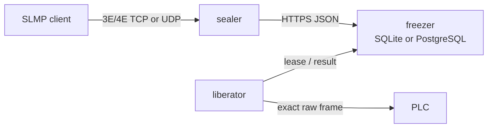

# TapirSLMP

[日本語](README.ja.md)

TapirSLMP relays raw MELSEC SLMP binary 3E/4E requests through a durable HTTP
job queue. A client talks to a local **sealer** as if it were a PLC. A
**liberator** next to the PLC pulls the oldest request, executes it, and returns
the exact response through the **freezer**.

> validate it against your PLC, network policy, and
> failure requirements before production use. SLMP write and remote-control
> commands can change or stop equipment.



## Why this shape

- PLC-side networks only need outbound HTTPS access to the freezer.
- The freezer requires durable storage. SQLite `:memory:` is rejected;
  serverless temporary folders are unsupported and must not be configured.
- SQLite keeps deployment small for one freezer instance on a persistent
  volume. PostgreSQL supports multiple freezer instances and higher
  concurrency.
- Requests are FIFO per route, with at most one active lease per route.
- Terminal jobs are retained for 168 hours by default, configurable with
  `Freezer__TerminalRetentionHours`.
- A state-changing request that may have reached the PLC but lost its response
  becomes `OutcomeUnknown`; TapirSLMP never silently repeats it.
- The freezer rejects all commands outside a conservative read-only allow-list
  unless an operator explicitly enables state-changing commands.

## Supported scope

| Capability | Support |
| --- | --- |
| Frames | Binary 3E and binary 4E |
| Client listener | TCP, UDP, or both |
| PLC transport | TCP and UDP, enabled per configured route |
| Storage | SQLite and PostgreSQL |
| Ordering | Oldest queued job first; one active job per route |
| ASCII SLMP | Not currently supported |
| SLMP command semantics | Frames are opaque except envelope validation and risk classification |

TapirSLMP is a request/response relay, not a VPN and not a transparent stream
tunnel. Each TCP request is parsed as one complete SLMP frame, persisted, and
answered before the next request on that connection.

## Packages

TapirSLMP ships as libraries. There is no prebuilt service executable: you host the
components inside your own applications.

| Package | Contents | Reference it from |
| --- | --- | --- |
| `TapirSLMP` | Metapackage: protocol, contracts, client, sealer, liberator | Every application in a deployment |
| `TapirSLMP.Protocol` | Binary 3E/4E parsing, correlation, command risk classification | Standalone SLMP tooling |
| `TapirSLMP.Contracts` | DTOs, gateway abstractions, `JobAdmissionPolicy` | Pulled in by the others |
| `TapirSLMP.Client` | `FreezerClient` and `HttpJobGateway` | Sealer or liberator hosts |
| `TapirSLMP.Sealer` | `ISlmpRelay`, TCP/UDP listeners, `AddTapirSealer()` | The application issuing SLMP requests |
| `TapirSLMP.Liberator` | Worker loop and PLC transport, `AddTapirLiberator()` | The application next to the PLC |
| `TapirSLMP.Freezer.Hosting` | `AddTapirFreezer()`, `MapTapirFreezer()` | Only the application hosting the freezer |
| `TapirSLMP.Storage` | `IJobStore`, `InProcessJobGateway` | Custom stores, in-process deployments |
| `TapirSLMP.Storage.Sqlite` / `.Postgres` | Store implementations | The freezer host |

`TapirSLMP.Freezer.Hosting` carries a framework reference to `Microsoft.AspNetCore.App`,
and the storage providers carry database drivers. Both are deliberately kept out of the
`TapirSLMP` metapackage so that applications which do not host the freezer neither need the
ASP.NET Core shared framework installed nor ship a database driver they never call.

From 1.0.0 the public API follows semantic versioning: breaking changes wait for a major
release. `TapirSLMP.Storage` is the extension point for custom job stores, so implementing
`IJobStore` outside this repository is supported and its shape is covered by that promise.

## Components

- `TapirSLMP.Sealer`: local TCP/UDP SLMP endpoint, or a direct `ISlmpRelay.RelayAsync`
  call when the frames originate inside your own application. It submits a raw frame and
  polls until the terminal result is available.
- `TapirSLMP.Freezer.Hosting`: authenticated ASP.NET Core HTTP API and job state
  machine, mapped into a web application you host.
- `TapirSLMP.Liberator`: outbound polling worker. Its route map pins each route
  key to a configured PLC host, port, allowed transport, and—by default—SLMP
  destination fields.
- `TapirSLMP.Protocol`: independent binary 3E/4E envelope parser and response
  correlator.
- `TapirSLMP.Contracts`: `JobAdmissionPolicy` holds the read-only allow-list, TTL
  clamping, and lease validation. Every path into the queue runs through it, so the
  safety defaults below do not depend on which transport a request arrives on.

## Embedding

Registering a sealer that talks to a remote freezer over HTTP:

```csharp
builder.Services.AddTapirFreezerClient(builder.Configuration);
builder.Services.AddTapirSealer(builder.Configuration);
```

Registering a liberator alongside the PLC:

```csharp
builder.Services.AddTapirFreezerClient(builder.Configuration);
builder.Services.AddTapirLiberator(builder.Configuration);
```

Hosting the freezer inside an existing ASP.NET Core application:

```csharp
builder.Services.AddTapirFreezer(builder.Configuration);
// ...
app.UseTapirFreezerHeaders();
app.MapTapirFreezer();
await app.Services.InitializeTapirFreezerAsync();
```

Issuing frames without a socket listener, when your application produces them directly:

```csharp
builder.Services.AddTapirSealerRelay(sealerOptions);   // no TCP or UDP listener
// ...
byte[] response = await relay.RelayAsync(requestFrame, SlmpTransportKind.Tcp, cancellationToken);
```

For a single-trust-zone deployment, `InProcessJobGateway` replaces the HTTP hop entirely
while still applying the same `JobAdmissionPolicy`. Bearer tokens do not apply on that path
because there is no network boundary to authenticate across; use the HTTP gateway whenever
the sealer and freezer sit in different trust zones. Runnable examples of all four shapes
live in `tests/e2e/hosts/`.

## Addressing several PLCs

A route key names one PLC. The liberator's route map pins each key to a host, port, and
allowed transports, so a client can never name a PLC address itself. Clients select a PLC
by choosing which sealer port they connect to:

```
Sealer__Listeners__0__Port=5000
Sealer__Listeners__0__RouteKey=plc1
Sealer__Listeners__1__Port=5001
Sealer__Listeners__1__RouteKey=plc2

Liberator__Routes__plc1__Host=192.168.0.10
Liberator__Routes__plc2__Host=192.168.0.11
```

For a single PLC the flat `Sealer__Port` and `Sealer__RouteKey` keys still work. One
liberator serves any number of routes, and separate routes progress in parallel; ordering
and the one-job-at-a-time rule apply per route.

Route keys appear in three places, so a typo is easy and its symptom is unhelpful: a job
for a key nobody serves simply sits queued until its TTL elapses. Listing the keys on the
freezer turns that into an immediate error, on submission and on lease acquisition:

```
Freezer__KnownRouteKeys__0=plc1
Freezer__KnownRouteKeys__1=plc2
```

Leaving the list empty preserves the original permissive behaviour. The freezer cannot
discover route maps by itself, so this list has to be kept in step with the sealers and
liberators by hand.

## Quick local run

Requirements: .NET SDK 10 and a reachable SLMP server. The commands below run the
reference hosts under `tests/e2e/hosts/`, which are minimal applications built on the
packages above rather than shipped executables. They use plain HTTP only on loopback for
development. Use HTTPS in real deployments.

Generate two independent URL-safe bearer tokens of at least 32 characters, then
start the freezer:

```bash
Freezer__SealerToken=aaaaaaaaaaaaaaaaaaaaaaaaaaaaaaaa \
Freezer__LiberatorToken=bbbbbbbbbbbbbbbbbbbbbbbbbbbbbbbb \
ASPNETCORE_URLS=http://127.0.0.1:5080 \
dotnet run --project tests/e2e/hosts/FreezerHost
```

Start a liberator whose `plc1` route points to the PLC or simulator:

```bash
Freezer__BaseAddress=http://127.0.0.1:5080 \
Freezer__Token=bbbbbbbbbbbbbbbbbbbbbbbbbbbbbbbb \
Freezer__AllowInsecureHttpForLoopback=true \
Liberator__Routes__plc1__Host=127.0.0.1 \
Liberator__Routes__plc1__Port=5007 \
dotnet run --project tests/e2e/hosts/LiberatorHost
```

Start the sealer at `127.0.0.1:5000`:

```bash
Freezer__BaseAddress=http://127.0.0.1:5080 \
Freezer__Token=aaaaaaaaaaaaaaaaaaaaaaaaaaaaaaaa \
Freezer__AllowInsecureHttpForLoopback=true \
dotnet run --project tests/e2e/hosts/SealerHost
```

An existing binary 3E/4E SLMP client can now target `127.0.0.1:5000`.

`tests/e2e/hosts/AllInOneHost` runs the same pipeline in a single process over
`InProcessJobGateway`, with no HTTP hop and no bearer tokens.

The example tokens are intentionally predictable and must never be reused
outside an isolated local test. Prefer environment injection from a secret
manager rather than committing tokens to configuration files.

## Docker freezer

The container exposes HTTP on port 8080. Bind it to loopback behind an HTTPS
reverse proxy, or place it on a private authenticated network.

```bash
cp .env.example .env
# Replace every value in .env before continuing.
docker compose -f compose.sqlite.yml up --build
```

For PostgreSQL:

```bash
docker compose -f compose.postgres.yml up --build
```

SQLite must live on the mounted `/app/data` volume. Do not place its database
in a serverless function's temporary directory. Use PostgreSQL when the freezer
can scale to more than one process or host.

## Direct JSON submission

The sealer is optional for applications that already have the complete SLMP
request frame. `byte[]` values use standard JSON base64 encoding:

```bash
curl --fail-with-body \
  -H 'Authorization: Bearer YOUR_SEALER_TOKEN' \
  -H 'Content-Type: application/json' \
  -d '{
    "clientRequestId": "request-01991a2b3c4d",
    "routeKey": "plc1",
    "transport": "Tcp",
    "requestFrame": "UAAA//8DAA4AEAABBAIAZAAAAKgAAgA="
  }' \
  https://freezer.example/v1/jobs
```

See [HTTP API](docs/http-api.md) for the complete contract.
Retry an uncertain submission with the same `clientRequestId`; the freezer
returns the original job instead of creating a duplicate.

## Safety defaults

`Freezer__AllowStateChangingCommands` defaults to `false`. The read-only list
contains only known pure reads (`0x0101`, `0x0401`, `0x0403`, `0x0406`); unknown
commands are treated as state-changing. To perform writes in a controlled test:

```bash
Freezer__AllowStateChangingCommands=true
```

Enabling this switch is an operator decision. Also restrict PLC permissions,
firewall the sealer listener, use distinct sealer/liberator tokens, terminate
TLS at or before the freezer, and do not expose the freezer directly to the
public Internet.

## Build and test

```bash
dotnet restore TapirSLMP.slnx
dotnet build TapirSLMP.slnx --configuration Release --no-restore
dotnet test TapirSLMP.slnx --configuration Release --no-build
```

CI adds a PostgreSQL integration test, container build, raw 3E/4E round-trips
through [VirtualMelsecR](https://github.com/mokouliszt/VirtualMelsecR), and a
compatibility smoke test using
[PlcComm.Slmp](https://github.com/fa-yoshinobu/plc-comm-slmp-dotnet). Both
external test sources are pinned to explicit commits in the workflow.

## Documentation

- [Architecture](docs/architecture.md)
- [HTTP API](docs/http-api.md)
- [Security and failure semantics](docs/security.md)
- [Security policy](SECURITY.md)

## Attribution and independence

The SLMP layer was implemented independently as a raw envelope relay. The two
projects above are used as public compatibility references and test fixtures;
their runtime source is not copied into TapirSLMP. Details are in
[third-party notices](THIRD_PARTY_NOTICES.md).

## License

MIT. See [LICENSE](LICENSE).

MELSEC and other product names are trademarks of their respective owners.
TapirSLMP is not affiliated with or endorsed by the equipment manufacturer.
