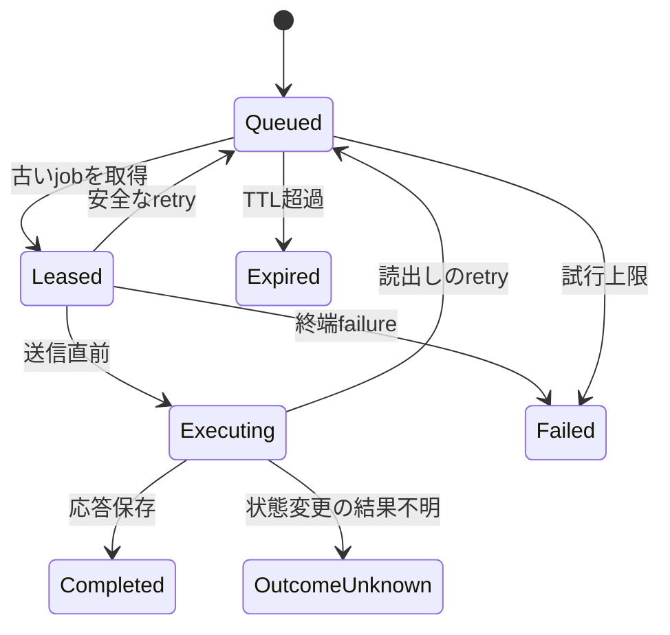

# Architecture

[English](architecture.md)

## Data path

1. clientがバイナリSLMP 3E/4E要求をTCPまたはUDPでsealerへ送ります。
2. sealerがenvelopeを検証し、同じbyte列をfreezerへ登録します。
3. freezerは`Queued` jobをDBへcommitしてから応答します。
4. liberatorが設定済みrouteのうち最も古いjobをleaseします。
5. 名前解決と接続を完了した後、PLCへ送る直前に`Executing`へ変更します。
6. frame種別、route、4Eのserialが一致する応答だけを受け入れ、そのまま保存します。
7. sealerが元のclientへ応答byte列を返します。

HTTP poll分の遅延は増えますが、LAN内の最短遅延より、単純で観測可能な永続化境界を
優先した設計です。

登録には生成した`clientRequestId`を付け、job IDもそこから決めます。POST応答を
失っても同じIDで再送・参照でき、2件目のPLC操作を作りません。異なるjob内容で同じ
IDを再利用することはできません。

## Job gateway

sealerとliberatorはHTTPに依存しません。`IJobSubmissionGateway` と `IJobWorkerGateway`
という2つの抽象に対して動作し、実装は2種類あります。

| 実装 | パッケージ | 経路 |
| --- | --- | --- |
| `HttpJobGateway` | `TapirSLMP.Client` | freezerが別の信頼ゾーンにある構成 |
| `InProcessJobGateway` | `TapirSLMP.Storage` | 1プロセス構成。HTTPの往復なし |

どちらも同一の `JobAdmissionPolicy`（`TapirSLMP.Contracts`）を通ります。このクラスが
伝文検証、書き込み許可リスト、TTLクランプ、lease識別子検証、応答相関を保持します。
policyをHTTP endpointではなく両gatewayの下位に置いているため、in-process経路を選んでも
安全既定が暗黙に失われることはありません。

in-process経路で適用されない唯一の要素はbearer token認証です。認証すべきネットワーク境界が
存在しないためです。sealerとfreezerが異なる信頼ゾーンにある場合は `HttpJobGateway` を
使用してください。

## 状態機械

`OutcomeUnknown`からの自動遷移はありません。PLCの実状態を確認したうえで、別の
新規要求を発行するかoperatorが判断します。

## 順序と並行性

`(created_at, id)`順で処理し、同じrouteには`Leased`または`Executing`を最大1件だけ
許します。異なるrouteは並行実行できます。

SQLiteはWAL、`synchronous=FULL`、即時writer transaction、partial unique indexを
使います。永続local volume上の単一freezer process向けです。PostgreSQL版はroute
rowをlockし、`FOR UPDATE SKIP LOCKED`で取得するため、複数freezerに対応します。

## Delivery semantics

PLC実行とDB commitを原子的にまとめる手段がSLMPにはないため、一般的な意味での
exactly-onceは保証できません。送信前のfailureと読出しはretry可能ですが、
`Executing`以降の状態変更要求は応答を失うと`OutcomeUnknown`になります。

TapirSLMPが解釈するのは3E/4E envelopeの長さ、route、command/subcommand、4E予約値、
end code、応答相関です。device payloadを解釈せず、成功応答を代作しません。
