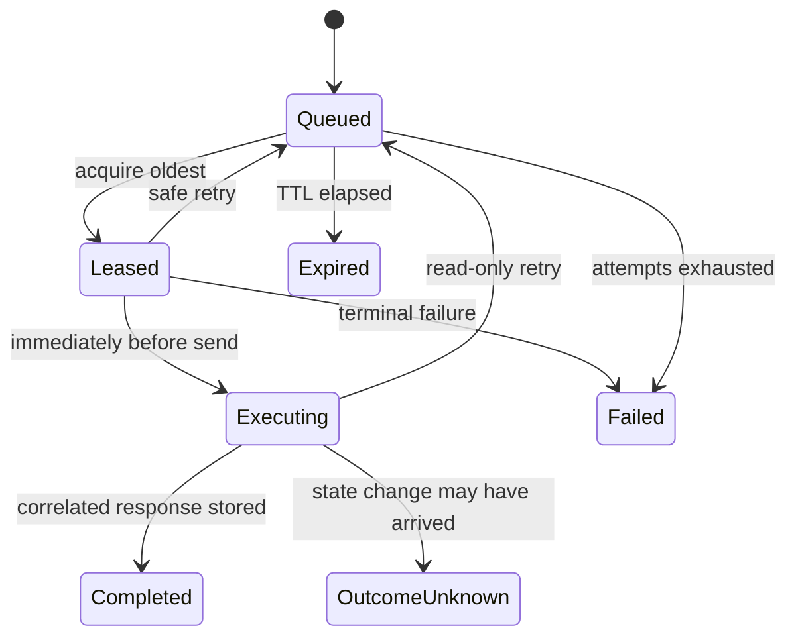

# Architecture

[日本語](architecture.ja.md)

## Data path

1. A client sends one binary SLMP 3E/4E request to a sealer over TCP or UDP.
2. The sealer validates the envelope and submits the exact bytes to the freezer.
3. The freezer commits a `Queued` job before acknowledging it.
4. A liberator leases the oldest eligible job for one configured route.
5. After DNS resolution and connection establishment, the liberator changes the
   job to `Executing` immediately before sending the bytes to the PLC.
6. It accepts only a response with the same frame type, route, and—on 4E—the
   same serial number, then stores the exact response.
7. The sealer returns those bytes to the original client.

HTTP polling adds latency; this design favors a simple, observable durability
boundary over minimum possible LAN latency.

Submissions carry a generated `clientRequestId`. The job ID is derived from it,
so a POST whose response is lost can be retried or queried without creating a
second PLC operation. The same ID cannot be reused with different job data.

## Job gateways

The sealer and the liberator do not depend on HTTP. They talk to two abstractions,
`IJobSubmissionGateway` and `IJobWorkerGateway`, which have two implementations:

| Implementation | Package | Path |
| --- | --- | --- |
| `HttpJobGateway` | `TapirSLMP.Client` | Sealer/liberator to a freezer in another trust zone |
| `InProcessJobGateway` | `TapirSLMP.Storage` | Everything in one process, no HTTP hop |

Both run every request through the same `JobAdmissionPolicy` instance
(`TapirSLMP.Contracts`), which owns frame validation, the read-only command allow-list,
TTL clamping, lease-identity checks, and response correlation. Placing the policy below
both gateways rather than in the HTTP endpoints means that choosing the in-process path
cannot silently remove the safety defaults.

The one thing the in-process path does not apply is bearer-token authentication, because
there is no network boundary to authenticate across. Use `HttpJobGateway` whenever the
sealer and the freezer belong to different trust zones.

## State machine

Terminal states are `Completed`, `Failed`, `Expired`, and `OutcomeUnknown`.
There is intentionally no automatic transition out of `OutcomeUnknown`.

## Ordering and concurrency

Ordering is based on `(created_at, id)`. Only one `Leased` or `Executing` row may
exist per route. Different routes can execute concurrently. This preserves the
order that matters to one PLC while allowing independent PLCs to make progress.

SQLite uses WAL, `synchronous=FULL`, an immediate writer transaction, and a
partial unique index. It is intended for one freezer process and a persistent
local volume. PostgreSQL locks a route row, selects work with `FOR UPDATE SKIP
LOCKED`, and uses the same partial uniqueness rule; it is the scaling option.

## Delivery semantics

The HTTP job leg is at-least-once for operations known to be safe to repeat.
Exactly-once execution cannot be guaranteed across a PLC/network failure because
SLMP does not provide a transaction identifier that the freezer can atomically
commit with PLC execution.

For that reason:

- failures before the `Executing` transition can be retried;
- read-only commands may be retried after an ambiguous response loss;
- state-changing commands after `Executing` become `OutcomeUnknown`;
- operators must reconcile `OutcomeUnknown` against PLC state before deciding
  whether a new request is safe.

## SLMP responsibility

TapirSLMP understands the binary 3E/4E envelope: lengths, route fields, command,
subcommand, 4E reserved value, response end code, and correlation identity. It
does not decode device payloads or manufacture successful PLC responses. This
keeps the relay compatible with commands it can safely transport while the
freezer's conservative risk classifier protects unknown operations.
